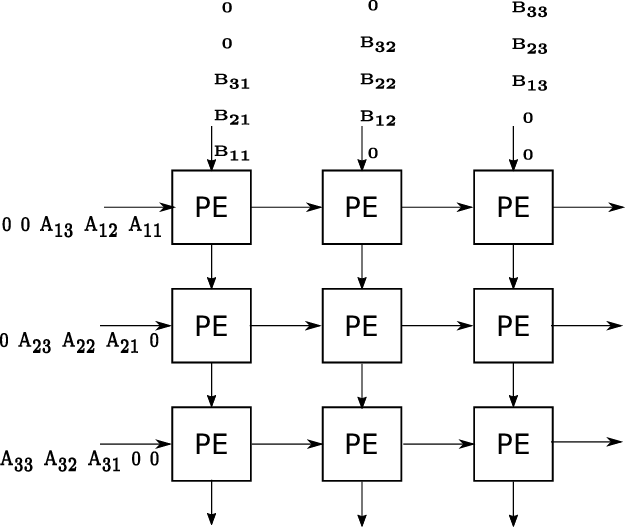

# Systolic Array Matrix Multiplication



## Overview

This repository contains a parametrized Verilog implementation of a systolic array for matrix multiplication. Systolic arrays are specialized hardware architectures designed for efficient parallel computations, particularly well-suited for matrix operations in applications like deep learning accelerators, signal processing, and scientific computing.

The name "systolic" comes from the medical term for rhythmic contraction, much like a heartbeat. In computing, it refers to how data rhythmically flows through an array of processing elements, creating a pipeline of calculations.

## Run on [EDA Playground](https://www.edaplayground.com/x/rvDL)

## Repository Contents

- `systolic_array.v` - Main module that instantiates and connects processing elements
- `processing_element.v` - Individual compute cell that performs multiply-accumulate operations
- `testbench.v` - Comprehensive testbench with random matrix generation and result verification

## Features

- **Fully Parametrized Design**:
  - Configurable array dimensions (ARRAY_SIZE)
  - Adjustable data width (DATA_WIDTH)
  - Auto-calculated accumulator width for precision

- **Efficient Architecture**:
  - Pipelined data flow for high throughput
  - Minimized control overhead
  - Regular structure for easy scaling

- **Robust Verification**:
  - Randomized test matrix generation
  - Automatic result verification
  - Detailed error reporting

## How It Works

The systolic array performs matrix multiplication by:

1. Feeding matrix elements in a skewed pattern into the array
2. Each processing element (PE) performs a multiply-accumulate operation
3. Data flows horizontally and vertically through the array
4. Results accumulate in place, with the final matrix available after 2N-1 cycles (where N is the matrix dimension)

## Parameter Configuration

| Parameter | Description | Default |
|-----------|-------------|---------|
| DATA_WIDTH | Bit width of input data elements | 8 |
| ARRAY_SIZE | Dimensions of the systolic array (N×N) | 3 |
| ACCUMULATOR_WIDTH | Bit width for result accumulation | 2*DATA_WIDTH + log2(ARRAY_SIZE) |

## Usage Example

```verilog
// Instantiate a 4×4 systolic array with 16-bit data
systolic_array #(
    .DATA_WIDTH(16),
    .ARRAY_SIZE(4),
    .ACCUMULATOR_WIDTH(36)  // Or let it calculate automatically
) matrix_multiplier (
    .clk(clk),
    .rst_n(rst_n),
    .enable(enable),
    .a_inputs(a_data),
    .b_inputs(b_data),
    .c_outputs(result),
    .computation_done(done)
);
```

## Simulation and Testing

The testbench provides comprehensive verification with:

1. Random matrix generation (values 1-9 for readability)
2. Reference software implementation for comparison
3. Automatic verification against expected results


## Applications

- Deep learning accelerators
- Image processing pipelines
- High-performance computing
- Signal processing systems
- Neural network inference engines

## Future Improvements

- Support for non-square matrices
- Optimized PE designs for specific operations
- Power gating for inactive elements

## References

- H.T. Kung and Charles Leiserson, "Systolic Arrays for VLSI", 1978
- Kung, S.Y., "VLSI Array Processors", 1988
- Norman P. Jouppi et al., "In-Datacenter Performance Analysis of a Tensor Processing Unit", 2017
